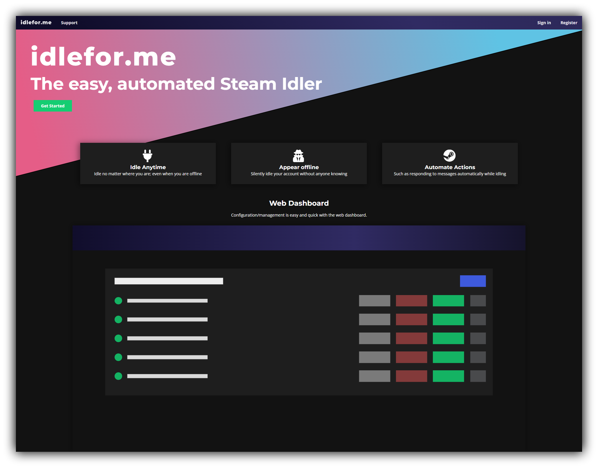
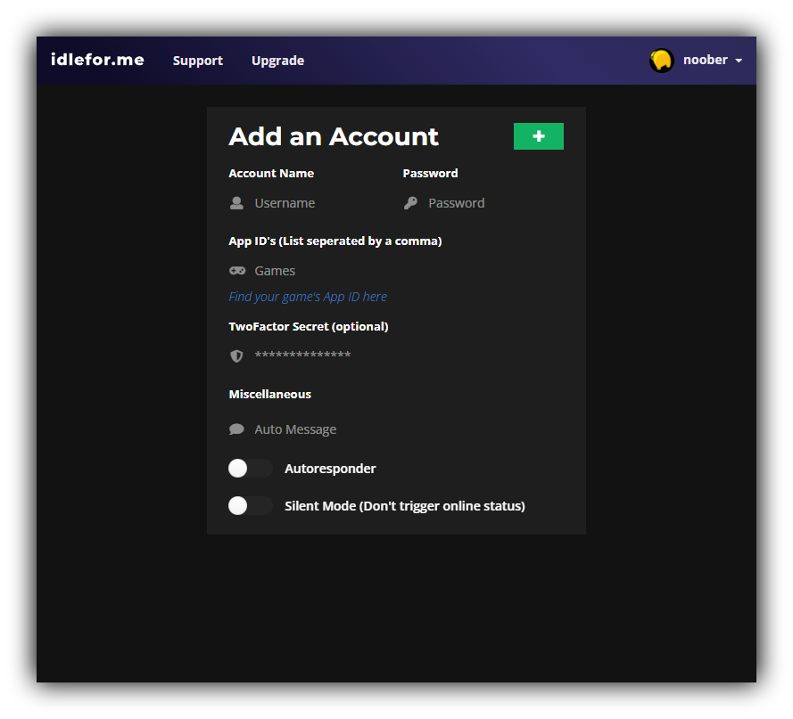
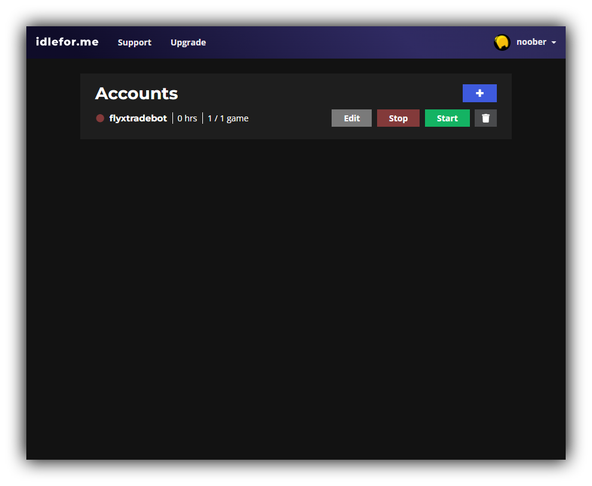
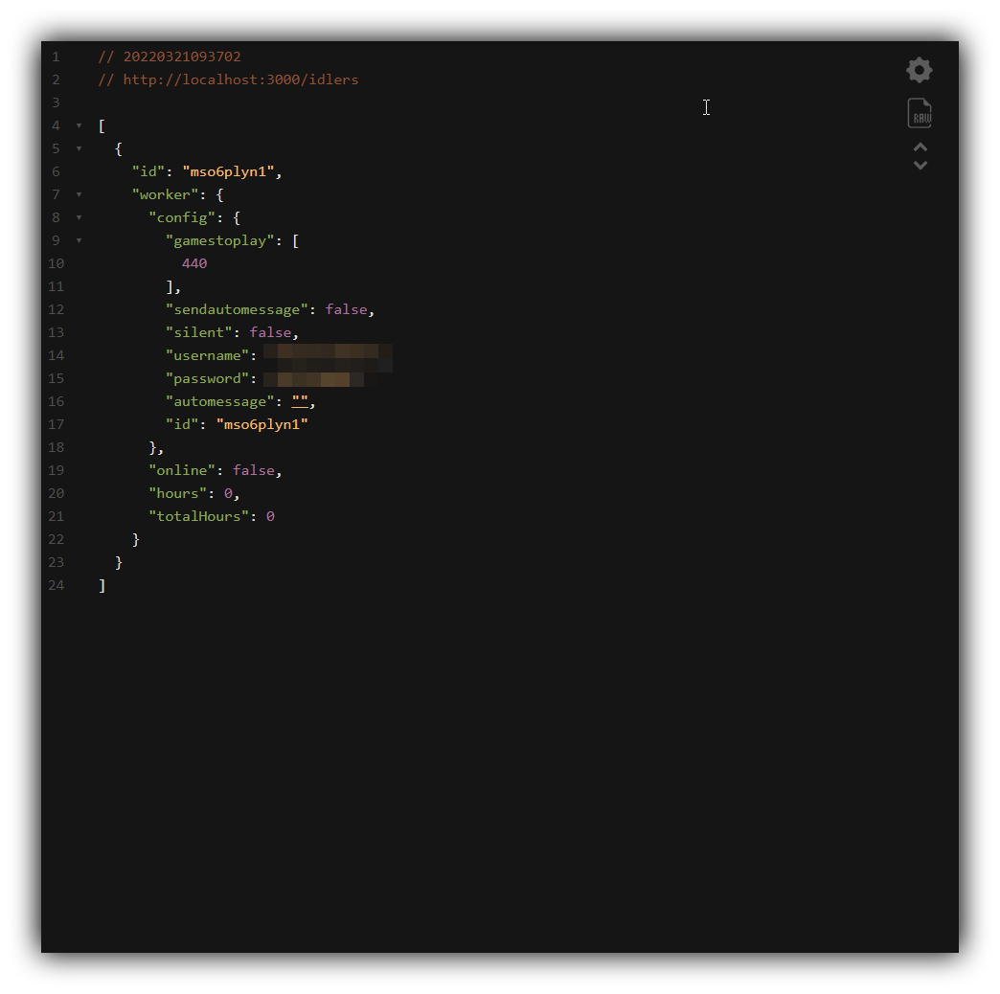

<span align="center" style="display: flex; flex-direction: column;">
  <h1><b>Steam Idler</b></h1>
  <p>A simple steam idling web app to farm hours in games</p>
</span>
<span align="center" style="display: flex; flex-wrap: wrap; justify-content: center; align-items: center"> 



</span>

<h1>Setup</h1>

> 📝 **Note:** Replace example .env files with correct information

### Install dependencies
```
npm i
```

### Run API daemon and Dashboard
```
node api/index.js
node dashboard/index.js
```

<h1>About</h1>
<h3>There are two components: the <b>Dashboard</b> and the <b>API</b>.</h3>

<span style="display: flex; flex-wrap: wrap; justify-content: center;"> 


</span>

<p>The <b>Dashboard</b> handles steam authentication and exposes a user friendly interface for creating, editing and deleting idlers. The <b>API</b> spawns and manages the idlers in workers and is completely seperate.</p>